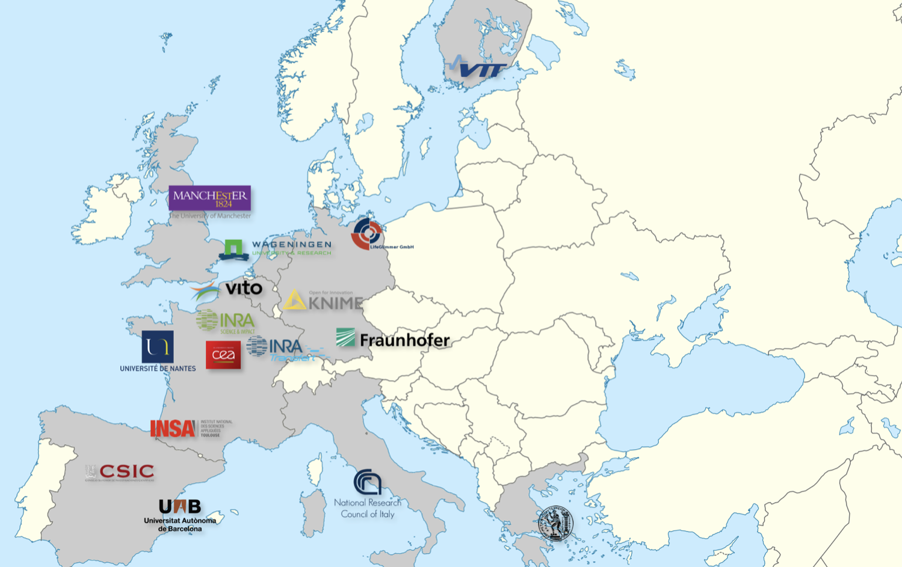

## 16 European partners

IBISBA 1.0 gathers together a wide and complementary consortium composed of **16 partners** from **9 European Union Member States**. These partners have been selected on the basis of the adequacy of their infrastructures to meet the aims of the starting community, the excellence of their RIs and track record of their scientific research, their shared willingness not only to create a rather unique network of RIs, but also to strive towards a common long-term vision. Accordingly, IBISBA 1.0 brings together some of the most prominent European players in the field of industrial biotechnology, as well as other partners that will supply vital expertise required to create the specific features of the IBISBA 1.0 network. Importantly, most of the partners have already worked with one or more of the other IBISBA 1.0 partners within the framework of previous collaborative research projects.

