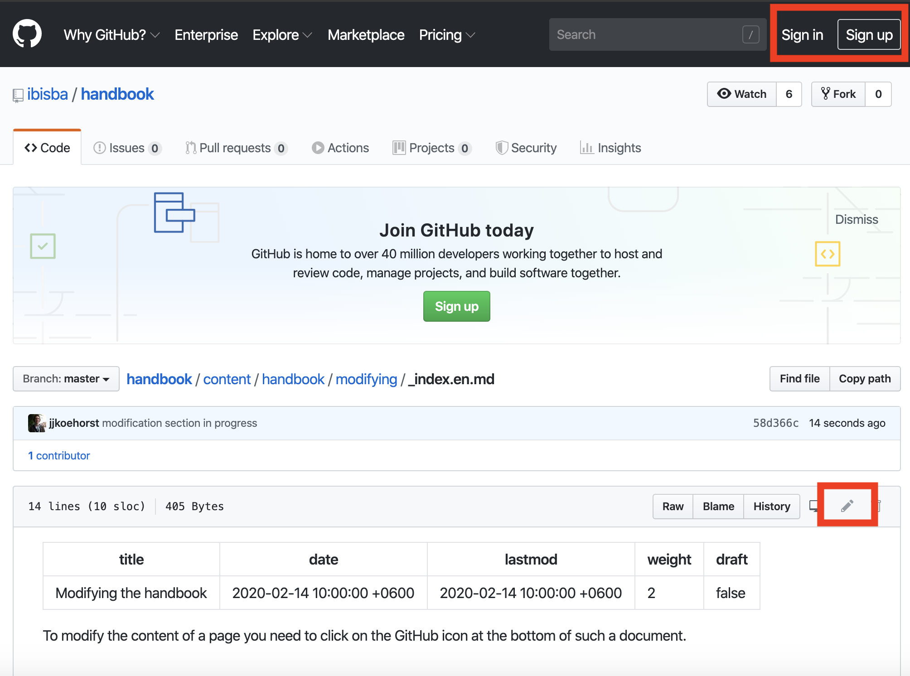

To modify the content of a page you need to click on the GitHub icon at the bottom of such a document.

When you click on this icon you are immediately brought to the online editor on GitHub in which you can modify the page that you were viewing.

To edit the actual content you first need to login (or signup if you do not have an account yet).
When you have logged in you can click the pencil button which brings you into the editor.

After entering the editor you can freely modify the text. Formatting is done according the MkDocs format ([Cheathseet](https://yakworks.github.io/mkdocs-material-components/cheat-sheet/)). When you finished editing the page and are satisfied with the content you can leave a small message about the changes you have made. This can be as short as 'fixing a typo', 'mkdocs formatting issue' or be more elaborate explaining what section was added and why. 

You can then make these changes directly or when you want to discuss about it you can click on the (***Create a new branch for this commit and start a pull request. Learn more about pull requests***). This will then start a request to merge the content and then other editors involved can more easily suggest modifications or accept the content directly.