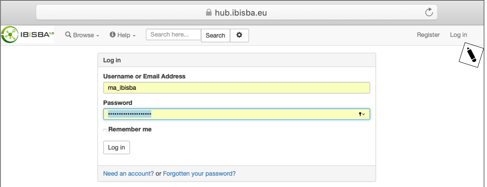
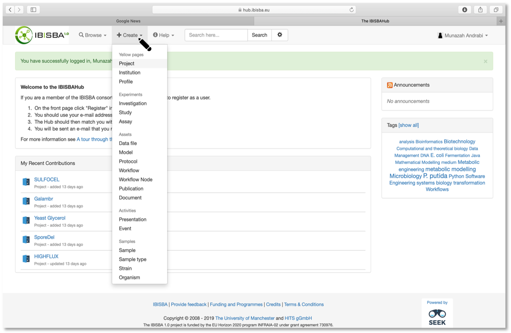
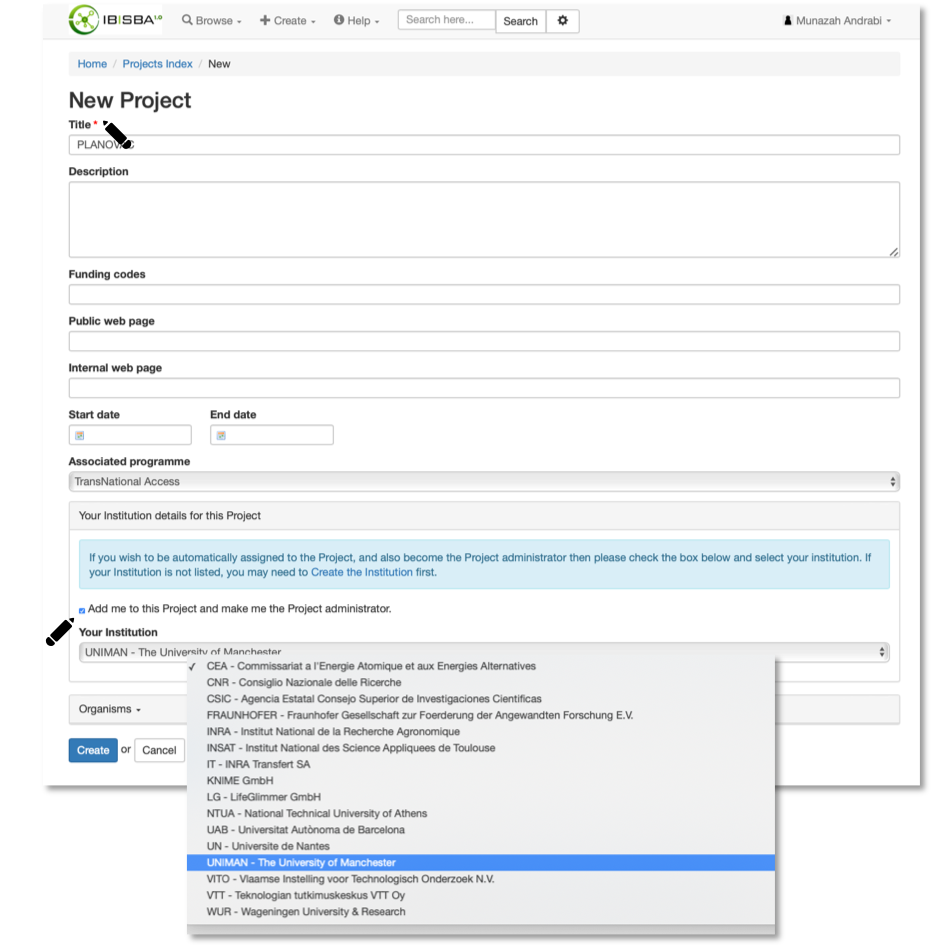
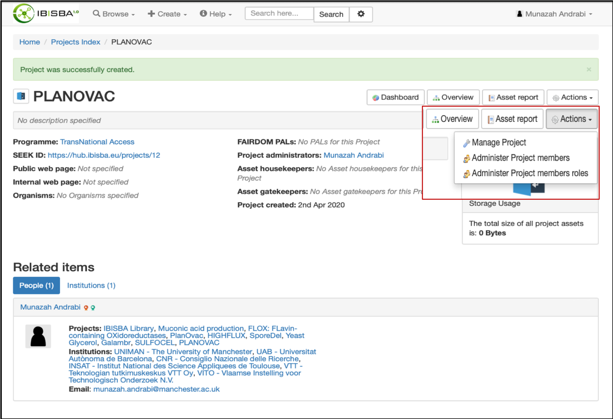

### Step1:

Go to https://hub.ibisba.eu and click **"Log in"** to sign into your account

### Step2:

After logging in click on the **"Create"** tab and from the pull down menu select **"Project"** and a New Project page will open 

### Step3:

  1.On the **"New Project"** page fill in the Title and any other information that is available to you
  
  2.From the **"Associated programme"** pull down menu choose TransNational Access
  
  3.Next check the box at the beginning of **“Add me to this Project and make me the Project administrator**”
  
  4.Next from the **"Your Institution"** pull down menu choose the  institution at which the project has been carried out( e.g. A       TNA site) 
  
  5.Click Create

### Step4:

Once the Project is created you can click on the **"Actions"** tab and select:

  1. **"Manage Project"** to edit any details about the project if you wish to
  
  

### Step5:

Once the Project is created you can click on the **"Actions"** tab and select: "Administer Project members" 

  1. To choose **name of person** involved in the project
  
  2. Select the associated **Institute name**
  
  3. Click the **"Confirm changes"** button
  

### Step6:

Once the Project is created you can click on the **"Actions"** tab and select: **"Administer Project members roles"**
  
  1.To assign **"administrative roles"** to member(s) 
  
  2.Click the **"Confirm changes"** button

